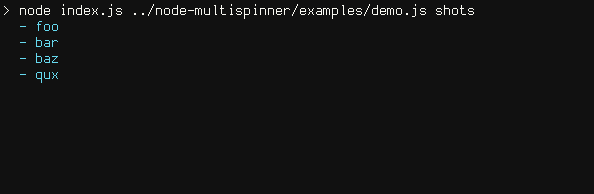

---

<b>[About](#about)</b> | 
<b>[Installation](#installation)</b> | 
<b>[API](#api)</b> | 
<b>[Examples](#examples)</b> | 
<b>[License](#license)</b> | 

## About

`node-multispinner` is a [Node.js](https://nodejs.org/) module for managing multiple progress indicators (spinners) in CLI apps.
This module is especially useful for apps with async tasks, as it enables completion of individual spinners, in any order, while other spinners continue spinning.
Node.js 4.0 or newer is required.



PS: thanks to @sindresorhus for his [log-update](https://github.com/sindresorhus/log-update) module, which was a major inspiration for and is used extensively in this module.

## Installation

Install and require as a standard Node module.

**Install**
```
  $ npm install --save multispinner
```

**Require**
```js
  var Multispinner = require('multispinner')
```

## API

### new Multispinner(spinners, options)

#### Spinners

An array of or object of spinner titles. Required.

**Array**

With an array of spinners, the displayed text and the string IDs for interacting with spinners are the same.

```js
var multispinner = new Multispinner([
  'Foo',
  'Bar',
  'Baz'
])
```

**Object**

Given object `{key: val}`, `val` is the spinner text while `key` is the string ID used to complete the spinner.

```js
var multispinner = new Multispinner({
  'Foo': 'Downloading Foo',
  'Bar': 'Transpiling Bar',
  'Baz': 'Writing Baz'
})
```

#### Options

Configurable options object. Optional.

```js
var spinners = ['foo', 'bar', 'baz']
var opts = {
  autoStart: false,
  clear: true
}
var multispinner = new Multispinner(spinners, opts)
```

**autoStart**

```js
{ autoStart: true }
```

If `true`, automatically start spinners after instantiating the `Multispinner` class.
If `false`, remember to start the spinners later with `multispinner.start()`.

**clear**

```js
{ clear: false }
```

If `true`, clear output with `logUpdate.clear()` after all spinners have finished.
If `false`, output persists.

**frames**

```js
{ frames: ['-', '\\', '|', '/'] }
```

Array of spinner frames.
These are cycled to create the spinner animation.
Note that frames needn't only be one character -- see the custom spinner example.

**indent**

```js
{ indent: 2 }
```

Number of character widths to indent spinners.

**interval**

```js
{ interval: 80 }
```

Number of milliseconds between animation frames.

**preText**

```js
{ preText: '' }
```

Text to insert before spinner text (but after spinner animation).
Example:

```js
var multispinner = new Multispinner(['foo', 'bar'], {
  preText: 'Completing'
})

/**
 * First frame of spinners
 * would look like this:
 *
 * - Completing foo
 * - Completing bar
 */
```

**postText**

```js
{ postText: '' }
```

Text to append after spinner text. See `preText` example.

**color**

```js
{
  incomplete: 'blue',
  success: 'green',
  error: 'red'
}
```
Colors used for spinners in each available state.
This module uses [chalk](https://github.com/chalk/chalk) for colorization, so any chalk-compatible color values are acceptable.
Individual colors can be customized without customizing the whole color object (e.g. `var opts = { color.incomplete: 'yellow' }`)

**symbol**

```js
{
  success: figures.tick,
  error: figures.cross
}
```
Symbols to use in place of the spinner animation for spinners that have completed.
[Figures](https://github.com/sindresorhus/figures) is used by default for some nice unicode symbols, but any strings are acceptable.
Like colors, individual symbols can be customized.

### multispinner.start()

### multispinner.success(spinner)

### multispinner.error(spinner)

### Events

## Examples

## License

[MIT](license)
